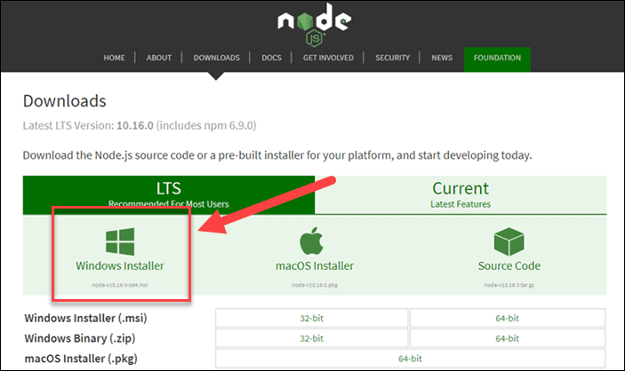

# ClinicWeb

---

## Pre-requisites

- Node.js
- Npm
- Angular CLI

---


## Installing Node.JS and NPM

1. Go to https://nodejs.org/en/download and download installer suitable for your system.



3. Perform standard installation by running downloaded file.
4. Verify installation by running following commands in terminal

```bash
node -v 
```

```bash
npm -v 
```

4. Install Angular CLI by running below command: 

```bash
npm install -g @angular/cli
```

5. Verify Angular CLI installation:

```bash
ng version
```

---

## Build & Run

1. Run `npm install` to install all dependencies.
2. Run `ng serve` to start a dev server.
3. Navigate to `http://localhost:4200/`.

---

